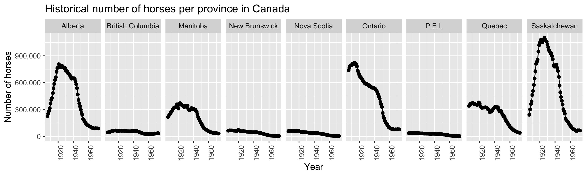

```{r, include = FALSE, message = FALSE, warning = FALSE}
library(tidyverse)
library(here)
```

## Aim

This project explores the historical population of horses in Canada between 1906 and 1972 for each province.

## Data

Horse population data were sourced from the [Government of Canada's Open Data website](http://open.canada.ca/en/open-data) (Government of Canada @horses1 and Government of Canada @horses2).

## Methods

The R programming language (R Core Team @R) and the following R packages were used to perform the analysis: knitr (Xie @knitr), tidyverse (Wickham @tidyverse), and bookdown (Xie @bookdown). *Note: this report is adapted from (Timbers @ttimbers-horses).*

## Results

```{r province, out.width="80%", fig.cap = "Horse populations for all provinces in Canada from 1906 - 1972", echo = FALSE}

```


We can see from Figure \@ref(fig:province) that Ontario, Saskatchewan and Alberta have had the highest horse populations in Canada. All provinces have had a decline in horse populations since 1940. This is likely due to the rebound of the Canadian automotive industry after the Great Depression and the Second World War. An interesting follow-up visualisation would be car sales per year for each Province over the time period visualised above to further support this hypothesis.

Suppose we were interested in looking in more closely at the province with the highest spread (in terms of standard deviation) of horse populations. We present the standard deviations here:

```{r all-sd, echo = FALSE, message = FALSE, warning = FALSE}
horses_sd_table <- read_csv("../../results/horses_sd.csv")
largest_sd <- horses_sd_table$Province[1]
knitr::kable(horses_sd_table, caption = "Standard deviations among the provinces")
```

Note that we define standard deviation (of a sample) as

$$s = sqrt( sum_{i = 1}^n(x_i - \bar{x}) / (n-1))$$

Additionally, note that in Table \@ref(tab:all-sd) we consider the sample standard deviation of the number of horses during the same time span as Figure \@ref(fig:province).

```{r highest-sd, out.width="50%", fig.cap = "Horse populations for the province with the largest standard deviation", echo = FALSE}
knitr::include_graphics("../../results/horse_pop_plot_largest_sd.png")
```


In Figure \@ref(fig:highest-sd) we zoom in and look at the province of `r largest_sd`, which had the largest spread of values in terms of standard deviation.

## References
